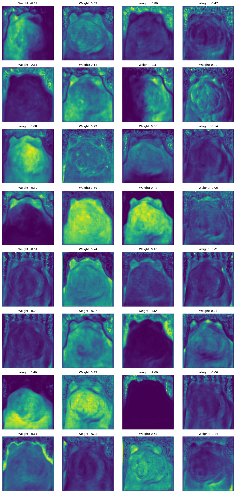

# YOLO Coefficient Visualizations

This repository contains tools and visualizations for analyzing YOLO model coefficients and feature representations. With the rapid growth of the computer vision field, the original YOLO papers have focused more on development rather than providing detailed explanations. This repository was created to bridge that gap by visualizing how YOLO works under the hood—especially in the context of instance segmentation.

## Overview

This project focuses on:
- **Extracting and Visualizing Prototype Masks:**  
  The code extracts 32 prototype masks (`proto_masks`) from the YOLO model's raw output and visualizes them alongside their corresponding mask coefficients (`mask_weights`). These coefficients are used to linearly combine the prototype masks to generate the final instance segmentation mask.

- **Understanding Positive and Negative Coefficients:**  
  The visualization shows both positive and negative coefficients. Positive coefficients contribute to the final mask by emphasizing features, while negative coefficients help subtract or suppress unwanted regions. This combination enables the model to form precise and refined segmentation masks.

- **Filling the Explanation Gap:**  
  Due to the fast-paced evolution in computer vision, the YOLO authors have often prioritized rapid development over detailed explanations. This repository aims to provide insight into the internal workings of YOLO-based segmentation methods, making it easier to understand the underlying processes.


## Notebook and Code Explanation

The notebook (`analyze_coefficient_mask.ipynb`) walks through the following steps:

1. **Feature Extraction:**  
   The notebook extracts the model's raw predictions (`raw_predictor`), which include:
   - **`proto_masks`:**  
     A set of 32 prototype masks with shape `(32, H, W)`. These masks represent learned spatial features for the entire image.
   - **`mask_weights`:**  
     A set of 32 coefficients (shape `(32,)`) corresponding to each prototype mask. These coefficients are used to linearly combine the prototypes into a final instance segmentation mask.

2. **Visualization:**  
   Using matplotlib, the code creates a grid of subplots. Each subplot displays a prototype mask and its associated weight. This visualization helps in understanding the role of each mask and how both positive and negative weights influence the final segmentation.

3. **Analysis:**  
   The analysis highlights how the combination of positive and negative coefficients allows the model to both include and subtract features, refining the final instance mask. This approach is inspired by the YOLACT framework, which prioritizes both efficiency and interpretability in real-time instance segmentation.

## Visual Output

Below is an example visualization generated by the notebook. The image `output.png` (located in the `visualizations/` folder) displays the 32 prototype masks along with their respective weights.




## Repository Structure

```
yolo-coefficient-visualizations/
├── data/               # Data directory
├── notebooks/          # Jupyter notebooks
├── src/               # Source code
├── utils/             # Utility functions
└── visualizations/    # Generated visualizations
```

## Setup

1. Clone the repository:
```bash
git clone https://github.com/yourusername/yolo-coefficient-visualizations.git
cd yolo-coefficient-visualizations
```

2. Create a virtual environment:
```bash
python -m venv venv
source venv/bin/activate  # On Windows: venv\Scripts\activate
```

3. Install dependencies:
```bash
pip install -r requirements.txt
```

## Usage

1. Run feature extraction:
```bash
python src/extract_features.py
```

2. Generate visualizations:
```bash
python src/generate_visualizations.py
```
3. Extract a specific mask coefficient from all images:
```bash
python extract_specific_feature.py --model "path/to/your/model.pt" --images_folder "data" --save_folder "visualizations" --csv_filename "mask_coefficient_31.csv" --coefficient_index 31
```


## License

This project is licensed under the MIT License - see the [LICENSE](LICENSE) file for details. 
